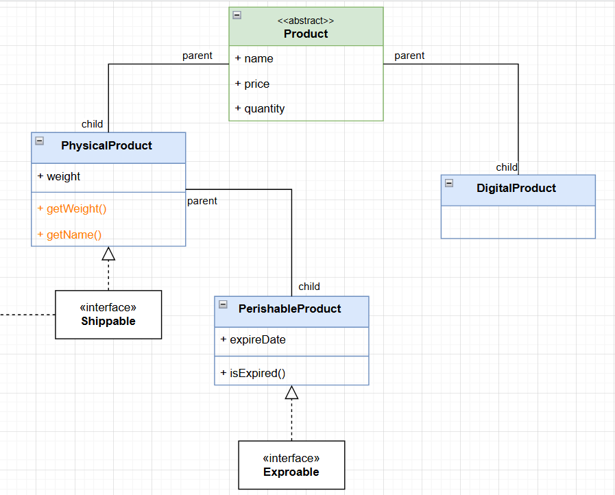

# Fawry E-commerce System

A robust Object-Oriented PHP e-commerce system demonstrating.

## 🚀 Quick Start

Open `index.php` in your web browser or run:
```bash
php index.php
```

## 📋 System Overview

- **Product Types**: Physical (has weight), Perishable products (weight and expiration date), and Digital (nor weight or expretion date)
- **Checkout Process**: Payment processing and order fulfillment

## 🏗️ Architecture

```
├── Models/          # Domain entities and business logic
├── Services/        # Business operations and calculations
├── UML/            # System design documentation
├── index.php       # Application entry point
└── autoload.php    # autoloader
```

## 📊 System Design

### UML Diagrams

*Complete system architecture and relationships*


*Product class hierarchy showing different product types*


*Shopping cart and customer interaction model*


*Shipping service and item management*


## 📦 Simple output
 
*Simple output of the system showing product details and cart contents*


## 🛍️ Models

### Core Models

#### Product (Abstract Base Class)
- Base class for all product types
- Product identification (name, price, quantity)
- Encapsulated properties with getter/setter methods

#### DigitalProduct
- Handles digital products (software, codes, downloads)
- No shipping required, instant delivery

#### PhysicalProduct
- Manages tangible products that require shipping
- Weight-based shipping calculations
- Implements Shippable interface

#### PerishableProduct
- Handles products with expiration dates
- Expiration date validation
- Implements Expirable interface

### Shopping Models

#### Customer
- Manages customer information and balance
- Balance tracking and payment processing

#### Cart
- Shopping cart management
- Add/remove items, calculate totals and shipping fees

#### CartItem
- Individual items in the shopping cart
- Quantity management, line item calculations

#### ShippingItem
- Wrapper for shippable products
- Shipping-specific information and calculations

### Interface Models

#### Shippable
- Interface for products that can be shipped
- Weight property and shipping calculations

#### Expirable
- Interface for products with expiration dates
- Expiration date management and validation

## 🔧 Services

### CheckoutService
**Primary Responsibility**: Orchestrates the complete checkout process

**Key Operations**:
- Payment processing with balance validation
- Receipt generation with itemized costs
- Shipping coordination for shippable items
- Shipment notices with package weights

### ShippingService
**Primary Responsibility**: Manages shipping operations and logistics

**Key Operations**:
- Tracks all shippable items
- Shows shipping items with weights
- Prepares items for shipping

### FeesCalcsService
**Primary Responsibility**: Calculates shipping fees based on weight

**Formula**: `Shipping Fee = ceil(weight / 100) × $10`

## 🎯 Key Features

### Product Type Flexibility
- **Digital Products**: No shipping, instant delivery
- **Physical Products**: Weight-based shipping calculations
- **Perishable Products**: Expiration date validation

### Robust Shopping Experience
- Cart management with total calculations
- Payment processing with balance validation
- Automatic shipping fee calculations

### Business Logic Validation
- Expiration checks for perishable items
- Balance validation for payments
- Weight validation for shipping

## 🔄 Workflow Example

1. **Product Creation**: Different product types instantiated
2. **Cart Population**: Products added to shopping cart
3. **Checkout Process**: Payment processing and receipt generation
4. **Shipping Preparation**: Shippable items routed to shipping service
5. **Balance Update**: Customer balance updated after purchase

## 🛠️ Technical Implementation

### Design Patterns Used
- **Strategy Pattern**: Different product types with varying behaviors
- **Interface Segregation**: Shippable and Expirable interfaces
- **Single Responsibility**: Each service has a focused purpose

### Code Quality Features
- Strong typing throughout the codebase
- Encapsulation with private properties and public accessors
- Exception handling for edge cases
- Clean architecture with separation of concerns

## 📈 Extensibility

The system is designed for easy extension:
- New product types by extending the Product base class
- Additional services for new business logic
- Enhanced features through new interfaces
- Database integration for persistence

This e-commerce system demonstrates professional software development practices with a focus on maintainability, extensibility, and clean code principles.